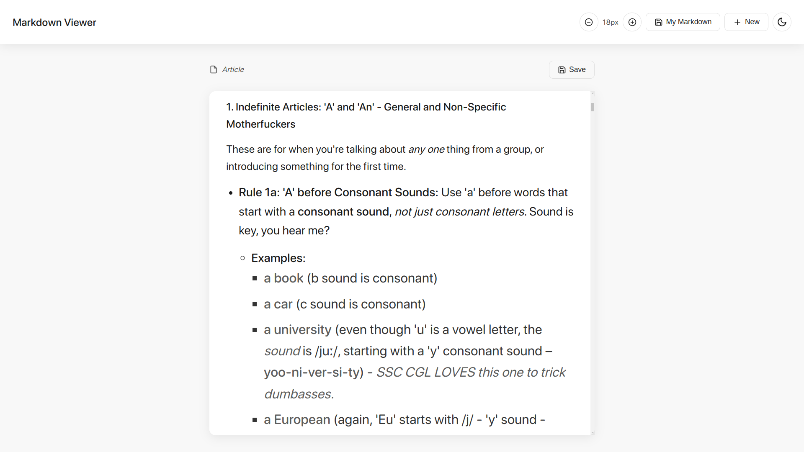

# Markdown Viewer

A lightweight, elegant Markdown viewer and editor with local storage capabilities. This application allows users to create, edit, save, and manage Markdown documents entirely in the browser.



## Features

- **Live Markdown Rendering**: Instantly preview your Markdown as you type
- **Local Storage**: Save your documents to your browser's local storage
- **Document Management**: Create, edit, view, and delete your Markdown documents
- **Dark/Light Mode**: Toggle between dark and light themes
- **Font Size Controls**: Adjust the display font size for better readability
- **Responsive Design**: Works seamlessly on desktop and mobile devices
- **Keyboard Shortcuts**: Productivity shortcuts for common actions
- **Minimalist Interface**: Clean, distraction-free viewing and editing experience

## Technology Stack

- **Frontend**: HTML5, CSS3, JavaScript (Vanilla)
- **Markdown Parser**: [Marked.js](https://marked.js.org/)
- **Storage**: Browser Local Storage API
- **Dependencies**: No framework dependencies, just Marked.js via CDN

## Getting Started

### Quick Start

1. Clone the repository:
   ```bash
   git clone https://github.com/yourusername/markdown-viewer.git
   ```

2. Open `index.html` in your browser:
   ```bash
   cd markdown-viewer
   open index.html  # Or double-click the file in your file explorer
   ```

That's it! No build steps or server setup required.

### Using the App

1. Click "New" to create a new Markdown document
2. Edit your Markdown in the editor modal
3. Click "Render Markdown" to view the rendered output
4. Save your document with a name for future access
5. Access saved documents via the "My Markdown" button


## Feature Details

### Document Management

All documents are stored in your browser's local storage, which means:
- No server or database required
- Documents persist between browser sessions
- Storage is limited to your browser's local storage capacity (typically 5-10MB)

### Theming

The app supports two themes:
- **Dark Mode**: Easy on the eyes, perfect for night-time use
- **Light Mode**: High contrast for daytime use

### Font Size Control

Adjust the font size for better readability:
- Size range: 12px to 24px
- Size adjustments automatically persist between sessions

## Development

### Project Structure

```
markdown-viewer/
│
└── index.html  # All-in-one HTML, CSS, and JavaScript
```

This project intentionally uses a simple, single-file structure for easy deployment and modification.

### Extending the App

#### Adding New Features

1. **Custom Themes**: Add new themes by extending the CSS variables in the `:root` and `[data-theme="dark"]` selectors
2. **Export Options**: Add functionality to export Markdown as PDF or HTML
3. **Markdown Extensions**: Add support for additional Markdown features via Marked.js extensions

#### Code Organization

The JavaScript follows this organization:
- DOM Elements
- App State Management
- Utility Functions
- Document Management
- Modal Handlers
- Event Listeners

## Browser Compatibility

Tested and working in:
- Chrome (latest)
- Firefox (latest)
- Safari (latest)
- Edge (latest)

## Performance Considerations

- The app uses vanilla JavaScript for maximum performance
- All operations are performed client-side
- Local storage operations are minimal and efficient
- The UI is designed to be responsive and work well on lower-end devices

## License

MIT License - Feel free to use, modify, and distribute as you see fit.

## Contributing

Contributions are welcome! Please feel free to submit a Pull Request.

1. Fork the repository
2. Create your feature branch (`git checkout -b feature/amazing-feature`)
3. Commit your changes (`git commit -m 'Add some amazing feature'`)
4. Push to the branch (`git push origin feature/amazing-feature`)
5. Open a Pull Request

## Roadmap

Future improvements planned:
- Import/export functionality for Markdown files
- Collaboration features via shared links
- Custom styling options for rendered Markdown
- Markdown syntax highlighting in the editor
- Image upload and embedding support

---

## About

This Markdown Viewer was created to provide a simple, efficient way to create and view Markdown documents without the need for complex setups or external dependencies. It demonstrates effective use of browser APIs and responsive design principles.

Feel free to [report issues](https://github.com/yourusername/markdown-viewer/issues) or suggest improvements!
